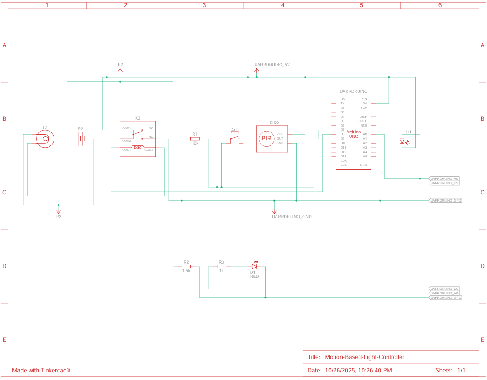

# Motion-Based-Light-Controller

# 🔆 Auto Light Controller (Arduino PIR + LDR)

This project is an **automatic lighting system** using an **Arduino**, a **PIR motion sensor**, and a **light sensor (LDR)**.  
It turns on a light (via relay) when motion is detected in dark conditions, and turns it off after a configurable delay.

---

## ⚙️ Features
- Auto light on when motion detected at night.
- Three brightness duration modes: 10s, 20s, 100s.
- “Always ON” and “Always OFF” modes.
- Button control (short press = change timer, long press = mode change).
- EEPROM memory for saving settings after power loss.
- Indicator LED blinks based on selected mode.

---

## 🧩 Components
| Component | Description | Arduino Pin |
|------------|-------------|--------------|
| PIR Sensor | Motion detection | D7 |
| LDR Sensor | Light sensor (analog) | A0 |
| Button | Mode switch | D2 |
| Relay Module | Control light | D8 |
| Indicator LED | Status signal | D9 |

---

## 🧠 Working Principle
1. Detects motion (PIR) only when light level is low (LDR).
2. Lights ON via relay for selected duration.
3. Saves configuration to EEPROM.
4. Supports “Always ON” and “Always OFF” modes.

---

## 🪛 Wiring Diagram

---

## 💻 Code
The main code is written in **Arduino C++** and compatible with **Arduino Uno / Nano / Mega**.

---

## 🧑‍💻 Author
Pham Nam Phuc - SEEE - HUST
Hoang Vi Ky - SEEE - HUST

---

## 📜 Warning
This project had already completed a year ago. This is an reuploaded version of our project.
